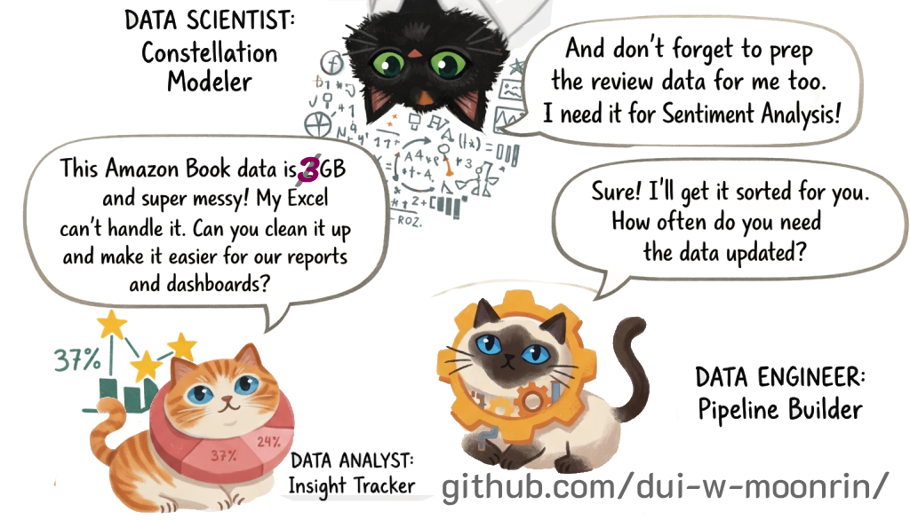
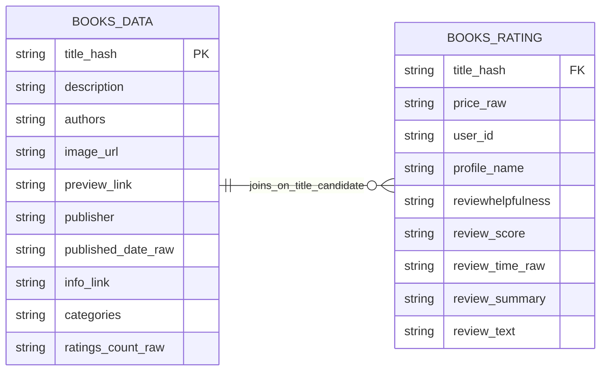
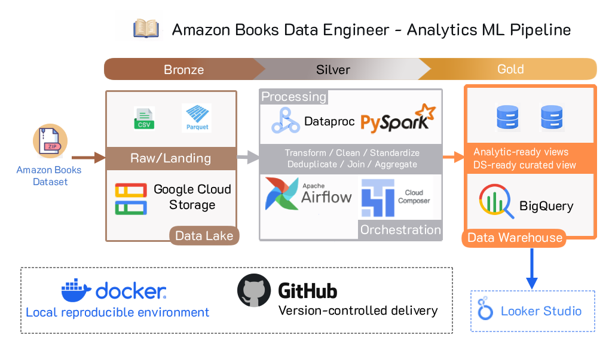

# 📚 Amazon Books Data Engineering Pipeline (End-to-End)
**ดุ๋ย – วัชรพงษ์ มูลรินทร์**  
**Dui – Watcharapong Moonrin**

> README หน้านี้เป็นเวอร์ชันภาษาไทยสำหรับใช้เป็น portfolio / GitHub project page  
> โปรเจกต์นี้โฟกัสการสาธิตความสามารถสาย **Data Engineer** เป็นหลัก ไม่ได้เน้นทำ dashboard เชิง Data Analyst แบบเต็มรูปแบบ

[เวอร์ชันเต็ม (ไทย) สามารถอ่านได้ที่นี่](README_FULL.md)

[English version can be read here](README_EN.md)

---
## 🚀 ภาพรวมโปรเจกต์

โปรเจกต์นี้เป็นพอร์ตสาย **Data Engineering** ที่ออกแบบ pipeline แบบ **end-to-end** สำหรับจัดการข้อมูลรีวิวหนังสือ Amazon ขนาดใหญ่ ตั้งแต่ชั้นข้อมูลดิบไปจนถึงชั้นข้อมูลพร้อมใช้งานสำหรับปลายทาง 2 กลุ่ม ได้แก่

- **Data Analyst (DA)** สำหรับงานวิเคราะห์ รายงาน และ dashboard
- **Data Scientist (DS)** สำหรับงาน Machine Learning / NLP ในอนาคต

ชุดข้อมูลต้นทางมีขนาดประมาณ **3 GB** (212,404 rows * 10 columns + 3,000,000 rows * 10 columns) และถูกออกแบบให้ไหลผ่าน pipeline แบบ **Bronze → Silver → Gold** โดยใช้แนวคิด **config-driven / environment-driven pipeline** เพื่อลดการ hardcode และทำให้สามารถแยกการทำงานระหว่าง local environment และ production-style environment บน GCP ได้ชัดเจน

---

## 🎯 กรณีศึกษาทางธุรกิจ

ข้อมูลดิบของ Amazon Books ไม่พร้อมสำหรับการใช้งานปลายทางโดยตรง เนื่องจากมีทั้งขนาดใหญ่ โครงสร้างข้อมูลไม่สม่ำเสมอ และมีคุณภาพข้อมูลที่ต้องผ่านการจัดการก่อน

### บทบาทของแต่ละทีม

- **Data Analyst (DA)** ต้องการข้อมูลที่สะอาดและพร้อมใช้งานสำหรับ dashboard และ report
- **Data Scientist (DS)** ต้องการข้อมูลรีวิวที่คัดกรองและจัดรูปแบบแล้ว สำหรับนำไปต่อยอดด้าน sentiment / NLP
- **Data Engineer (DE)** รับโจทย์จากทั้งสองฝั่ง แล้วออกแบบ pipeline แบบ **batch-oriented** เพื่อให้ข้อมูลถูกส่งต่ออย่างเหมาะสม

### สรุปโจทย์แบบ STAR

**S – Situation**  
มีข้อมูลรีวิวหนังสือ Amazon ขนาดประมาณ 3 GB ซึ่งใหญ่เกินกว่าจะนำไปใช้งานปลายทางตรง ๆ ได้อย่างมีประสิทธิภาพ

**T – Task**  
ออกแบบและพัฒนา pipeline เพื่อ ingest, clean, standardize, validate และ publish ข้อมูลให้พร้อมสำหรับ downstream use cases ของทั้ง DA และ DS

**A – Action**  
พัฒนา pipeline แบบ Bronze → Silver → Gold โดยใช้ PySpark สำหรับการแปลงข้อมูล, GCS สำหรับ storage, Dataproc สำหรับ processing, Airflow / Cloud Composer สำหรับ orchestration และ BigQuery เป็น serving layer

**R – Result**  
ได้ pipeline ที่สามารถส่งข้อมูลจาก raw source ไปยัง BI-ready layer ได้จริง และสามารถนำข้อมูลปลายทางไปเชื่อมกับ Looker Studio เพื่อสาธิต downstream analytics consumption ได้

---

## 🗂 Dataset

โปรเจกต์นี้ใช้ข้อมูลจาก [Amazon Books Reviews dataset](https://www.kaggle.com/datasets/mohamedbakhet/amazon-books-reviews/data) ซึ่งมีข้อมูลรวมประมาณ **3 GB** แบ่งเป็น 2 ตารางหลัก

| Table Name       | Description                      | Rows       | Size      |
|------------------|----------------------------------|------------|-----------|
| `books_data`     | ข้อมูลระดับหนังสือ              | 212,404    | ~181 MB   |
| `books_rating`   | ข้อมูลระดับรีวิว / ธุรกรรมรีวิว | 3,000,000  | ~2.86 GB  |

### 🧱 Entity Relationship - ERD (ช่วงออกแบบ Pipeline)

---

## 🏗 ภาพรวมสถาปัตยกรรม

### Architecture Layers

- **Source Layer**  
  Amazon Books raw dataset (`books_data`, `books_rating`)

- **Bronze Layer**  
  เก็บข้อมูลดิบและแปลงเป็น parquet เพื่อให้พร้อมสำหรับ downstream processing

- **Silver Layer**  
  ทำความสะอาดข้อมูล, standardize schema, เติมค่า default ที่จำเป็น, enrich คุณภาพข้อมูล, และทำ data quality checks

- **Gold Layer**  
  เตรียมข้อมูลสำหรับ consumption ปลายทาง ทั้งฝั่ง BI และ future DS use case

- **Serving Layer**  
  ใช้ BigQuery สำหรับ serving tables / views

- **Consumption Layer**  
  ใช้ Looker Studio สำหรับสาธิต downstream analytics consumption

---

## 🛠 Tech Stack

### Core Data Engineering
- **PySpark**
- **Apache Airflow**
- **Google Cloud Composer**
- **Google Cloud Storage (GCS)**
- **Google Cloud Dataproc Serverless**
- **BigQuery**
- **Looker Studio**

### Local Development / Reproducibility
- **Docker**
- **Docker Compose**
- **Apache Airflow 3.2.0 (Local)**
- **Python**
- **VS Code**
- **Git / GitHub**

### Cloud / Production-style Components
- **Apache Airflow 2.10.5 on Cloud Composer**
- **Kubernetes (K8s)**
- **Dataproc Serverless Batches**
- **GCS Buckets**
- **BigQuery serving layer**
- **IAM / Service Accounts**
- **Cloud Logging**
- **Kaggle dataset as source ingestion target**

### Data Processing / Data Modeling Approach
- **Bronze → Silver → Gold**
- **Config-driven transformations**
- **Environment-driven path resolution**
- **Data quality checks**
- **Relationship checks**
- **Serving views for BI consumption**

---

## 🥉 Bronze Layer

Bronze layer มีหน้าที่ ingest ข้อมูลดิบเข้าสู่ระบบ และเปลี่ยนรูปแบบจาก raw CSV ไปเป็น parquet โดยยังเก็บลักษณะของข้อมูลให้ใกล้เคียงต้นฉบับมากที่สุด

### งานหลักใน Bronze

- รับ raw CSV
- rename/select columns
- เก็บผลลัพธ์เป็น parquet
- ลดขนาดไฟล์จาก CSV เพื่อให้ processing ชั้นถัดไปทำงานได้ง่ายขึ้น

---

## 🥈 Silver Layer

Silver layer เป็นชั้นที่สำคัญที่สุดของโปรเจกต์นี้ เพราะเป็นชั้นที่ทำให้ข้อมูล “พร้อมใช้”

### งานหลักใน Silver

- standardize schema
- cast data types
- parse date / time
- generate helper keys เช่น `title_key`, `title_hash`
- fill default values สำหรับบางฟิลด์ที่ null
- enrich quality-related flags
- split eligible vs quarantine
- run data quality checks
- run relationship checks

---

## 🥇 Gold Layer

Gold layer เป็นชั้นสำหรับส่งมอบข้อมูลให้ปลายทาง

---

## 📦 BigQuery Serving Views

เพื่อสาธิตว่า data pipeline ส่งต่อไปถึงชั้น consumption ได้จริง โปรเจกต์นี้สร้าง serving views สำหรับ BI เช่น

- `v_book_performance_bi`
- `v_review_daily_bi`
- `v_category_summary_bi`

หน้าที่ของ views เหล่านี้ไม่ใช่เพื่อทำ dashboard ที่ลึกแบบ Data Analyst เต็มตัว แต่เพื่อพิสูจน์ว่า

- BigQuery serving layer พร้อมใช้งาน
- downstream BI tools สามารถเชื่อมต่อได้จริง
- pipeline ไปถึงปลายทางได้จริง

---

## 📊 Looker Studio Demo

[Demo](https://datastudio.google.com/s/o4eNN6GTweM)

*เนื่องจากเป็นเพียงการสาธิตว่าสามารถนำ Gold ไปใช้งานขึ้น BI ได้ จึง Implement Demo เพียงบางส่วนเท่านั้น*

Looker Studio ถูกใช้ในโปรเจกต์นี้เพื่อสาธิตการใช้งานข้อมูลปลายทางแบบรวดเร็ว โดยมีเป้าหมายหลักคือ

- แสดงว่า serving views พร้อมใช้งาน
- แสดงว่าข้อมูลจาก BigQuery ถูกนำไปใช้ใน BI layer ได้จริง
- แสดง final handoff capability ของ Data Engineer

จุดประสงค์ของ dashboard นี้ **ไม่ใช่การทำ storytelling เชิงธุรกิจแบบเต็มรูปแบบ**  
แต่เป็นการทำ **BI sample output** เพื่อแสดงปลายทางของ pipeline

---

## 💡 ทักษะที่แสดงในโปรเจกต์นี้

- ออกแบบ data pipeline แบบ Bronze → Silver → Gold
- ใช้ PySpark สำหรับ processing ข้อมูลขนาดใหญ่
- แยก local / production-style pipeline
- ออกแบบ config-driven / environment-driven workflow
- ใช้ GCS, Dataproc, BigQuery, Airflow / Composer และ Looker Studio
- ทำ data quality checks หลายมิติ
- จัดการ dependency / packaging / orchestration issues บน cloud runtime
- ตัดสินใจ trade-off เพื่อส่งมอบ output ภายใต้ข้อจำกัดจริง

## 🔒 Scope 

โปรเจกต์นี้ตั้งใจทำใน **สำหรับสมัครงานสาย Data Engineer** โดยโฟกัสที่สิ่งสำคัญก่อน ได้แก่

- batch ingestion
- data transformation ด้วย PySpark
- local + production-style cloud path
- BigQuery serving layer
- BI demonstration
- README / GitHub packaging

### สิ่งที่ยังไม่รวมใน MVP

- streaming / real-time pipeline
- full production monitoring / alerting
- production-grade CI/CD
- Infrastructure as Code แบบเต็มระบบ
- advanced observability framework

---

## 🚧 Future Improvements

- เพิ่ม unit / integration tests
- ขยาย quality checks ให้ครบทุกมิติยิ่งขึ้น
- ปรับ tuning / partitioning ให้เหมาะกับ data volume มากขึ้น
- เพิ่ม lineage / observability
- ทำ English README version ให้สมบูรณ์
- ขยาย DS-ready serving outputs ให้ลึกขึ้น
- เติม SCD Type-2 ในตาราง โดยใช้ทุก field xxhash64 เป็น hash_value

---

## ✅ สรุป

โปรเจกต์นี้เป็น Data Engineering portfolio ที่ออกแบบมาเพื่อสาธิตความสามารถในการส่งข้อมูลจาก raw source ไปยัง serving layer ที่พร้อมใช้งานจริง โดยครอบคลุมทั้ง

- local development path
- production-style processing on GCP
- BigQuery serving layer
- downstream BI demonstration
- ข้อมูลสามารถถูก ingest, transform, validate และ publish ได้จริง
- pipeline สามารถไหลจาก raw layer ไปจนถึง BI-ready layer ได้จริง
- ผู้พัฒนามีประสบการณ์แก้ปัญหาเชิง runtime, packaging, resource quota, config separation และ cloud limitations ในบริบทใกล้เคียงงานจริง

โปรเจกต์นี้จึงถูกวางตำแหน่งให้เป็น **Data Engineer portfolio** อย่างชัดเจน มากกว่าการเป็น dashboard portfolio เพียงอย่างเดียว