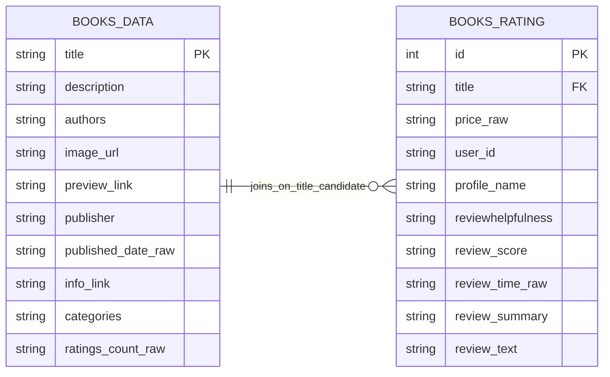

# 📚 Amazon Books DE Analytics ML Pipeline
By "Dui" Watcharapong Moonrin

An end-to-end **data engineering portfolio project** that prepares Amazon Books raw data for two downstream use cases:

- **Analytics / reporting** for Data Analysts
- **Curated review data** for future **ML / NLP** work by Data Scientists

This project focuses on building a practical DE pipeline using **PySpark, Google Cloud Storage, Dataproc, BigQuery, and Looker Studio** to transform raw book and review data into clean, reusable serving layers.

---

## 🚀 Project Overview

Raw Amazon Books data is often not immediately ready for analytics or machine learning workflows.  
This project simulates the role of a **Data Engineer** who prepares data for downstream consumers by building a lightweight end-to-end pipeline.

The pipeline is designed to:

- ingest raw Amazon Books data
- clean and standardize book and review records
- publish analytics-ready serving views
- publish DS-ready curated review data
- demonstrate downstream consumption through dashboard and report examples

---

## 🎯 Business Use Case


**Amazon Books Data ~(3GB)**
- **Data Analyst (DA)** needs clean, analytics-ready outputs for dashboards and reports because the raw dataset is too large and too messy for direct spreadsheet or BI use.
- **Data Scientist (DS)** needs curated review-level text data for future NLP and sentiment analysis use cases.
- **Data Engineer (DE)** responds by defining output requirements and refresh frequency first, then designing a **batch-oriented pipeline** to serve both downstream consumers.

---

## 🏗 Architecture Diagram


### Architecture Layers / Tech Stack

- **Source Layer**: Amazon Books raw dataset (`books_data`, `books_rating`) as the upstream data source  
- **Storage Layer (Bronze)**: **Google Cloud Storage (GCS)** for raw and landing data zones  
- **Processing Layer (Silver)**: **PySpark** jobs executed on **Dataproc** for data cleansing, standardization, and transformation  
- **Orchestration Layer**: **Apache Airflow (Cloud Composer)** for batch workflow orchestration and task scheduling  
- **Serving Layer (Gold)**: **BigQuery** serving **analytics-ready views** and **DS-ready curated datasets**  
- **Consumption Layer**: **Looker Studio** dashboards and reports for analytics consumption  
- **Development Layer**: **Docker** for local reproducible environments and **GitHub** for version-controlled delivery

## 🗂 Dataset

This project uses the [**Amazon Books Reviews dataset**](https://www.kaggle.com/datasets/mohamedbakhet/amazon-books-reviews/data), consisting of approximately **3 GB of raw data** across two primary tables.

_The files have information about 3M book reviews for 212,404 unique book and users who gives these reviews for each book. The source dataset is updated monthly, but this project demonstrates a batch-oriented DE design_

### 📊 Data Overview

| Table Name     | Description                     | Rows       | Size    |
|----------------|----------------------------------|------------|---------|
| `books_data` | Book-level metadata              | 212,404    | ~181 MB |
| `books_rating` | Review-level transactional data  | 3,000,000  | ~2.86 GB |

---

### 🧱 Entity Relationship - ERD (source-aligned)



## 🔄 Pipeline Flow & Outputs

### 🔁 Pipeline Flow

The pipeline follows a **batch-oriented workflow**:

1. Ingest raw data into **Google Cloud Storage (GCS)**  
2. Execute **PySpark jobs on Dataproc** for data cleansing and transformation  
3. Standardize and split data into:
   - analytics-ready datasets  
   - DS-ready curated datasets  
4. Publish outputs as **BigQuery views**  
5. Enable downstream consumption via **Looker Studio**

---

### ⏱ Orchestration (Airflow DAG)


The pipeline is orchestrated using **Apache Airflow (Cloud Composer)** to manage task dependencies, scheduling, and batch execution.

---

### 📦 Serving Outputs

#### 📊 Analytics-ready Views (for Data Analysts)
- `vw_book_catalog`
- `vw_review_summary`
- `vw_review_trend`

#### 🤖 DS-ready Curated Dataset (for Data Scientists)
- `vw_ds_review_text_curated`

---

### 📊 Dashboard & Report
https://datastudio.google.com/s/rl8YWVJNbvg


These outputs demonstrate how the pipeline supports downstream analytics and reporting use cases.

---

## 💡 Skills Demonstrated

- End-to-end **data pipeline design (Bronze → Silver → Gold)**  
- Data processing using **PySpark on Dataproc**  
- Workflow orchestration with **Apache Airflow (Cloud Composer)**  
- Data warehousing and serving via **BigQuery**  
- Delivering analytics-ready and ML-ready datasets  
- Supporting downstream teams (Data Analyst / Data Scientist)

---

## 📁 Repository Structure

```text
project-root/
│
├── README.md

```
## 🔒 Scope (MVP)

This project focuses on a minimum viable data pipeline:

- Batch data ingestion and transformation
- PySpark-based data processing
- BigQuery serving layer
- Basic dashboard and report demonstration
- GitHub-ready documentation

### The following items are intentionally out of scope:

- Real-time / streaming pipeline
- Full production monitoring and alerting
- Advanced data quality frameworks
- Infrastructure-as-Code (Terraform)

## 🚧 Future Improvements
- Add data quality validation checks (e.g., null, duplicates, constraints)
- Implement unit and integration testing for pipeline reliability
- Extend orchestration with more robust DAG structure
- Introduce streaming ingestion (Kafka)
- Explore container orchestration (Kubernetes)
- Improve performance optimization and partitioning strategies