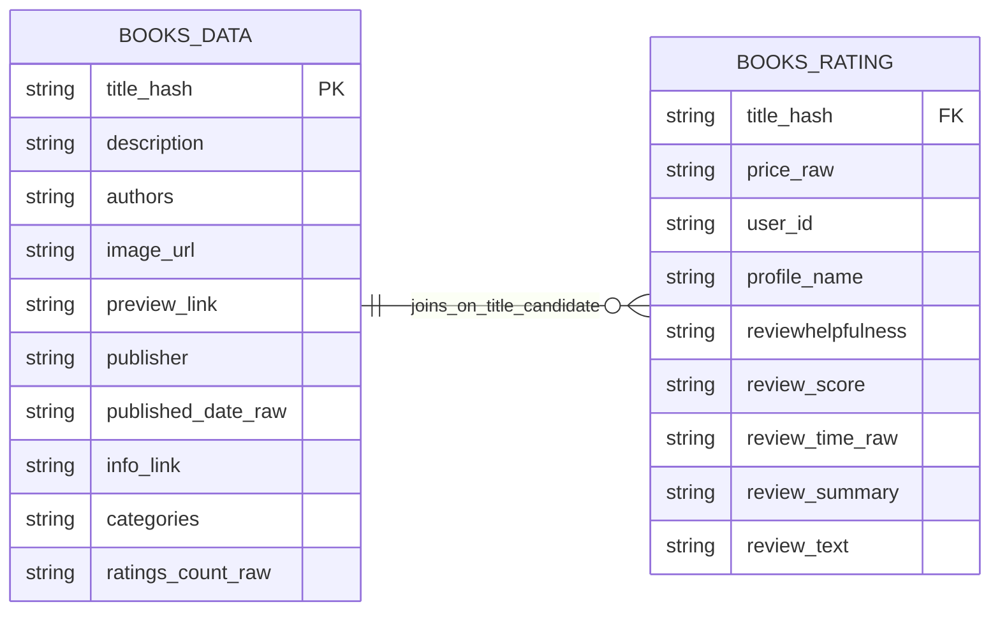

# 📚 Amazon Books Data Engineering Pipeline (End-to-End)
Dui – Watcharapong Moonrin

An end-to-end **data engineering portfolio project** that prepares Amazon Books raw data for two downstream use cases:

- **Analytics / reporting** for Data Analysts
- **Curated review data** for future **ML / NLP** work by Data Scientists

This project focuses on building a practical DE pipeline using **PySpark, Google Cloud Storage, Dataproc, BigQuery, and Looker Studio** to transform raw book and review data into clean, reusable serving layers.

---

## 🚀 Project Overview

Raw Amazon Books data is often not immediately ready for analytics or machine learning workflows.  
This project simulates the role of a **Data Engineer** who prepares data for downstream consumers by building a lightweight end-to-end pipeline.

The pipeline is designed to:

- ingest raw Amazon Books data
- clean and standardize book and review records
- publish analytics-ready serving views
- publish DS-ready curated review data
- demonstrate downstream consumption through dashboard and report examples

---

## 🎯 Business Use Case

**Amazon Books Data ~(3GB)** [212,404 rows * 10 columns + 3,000,000 rows * 10 columns]
- **Data Analyst (DA)** needs clean, analytics-ready outputs for dashboards and reports because the raw dataset is too large and too messy for direct spreadsheet or BI use.
- **Data Scientist (DS)** needs curated review-level text data for future NLP and sentiment analysis use cases.
- **Data Engineer (DE)** responds by defining output requirements and refresh frequency first, then designing a **batch-oriented pipeline** to serve both downstream consumers.

---

## 🏗 Architecture Diagram

## 🛠 Tech Stack

### Core Data Engineering
- **PySpark**
- **Apache Airflow**
- **Google Cloud Composer**
- **Google Cloud Storage (GCS)**
- **Google Cloud Dataproc Serverless**
- **BigQuery**
- **Looker Studio**

### Local Development / Reproducibility
- **Docker**
- **Docker Compose**
- **Apache Airflow 3.2.0 (Local)**
- **Python**
- **VS Code**
- **Git / GitHub**

### Cloud / Production-style Components
- **Apache Airflow 2.10.5 on Cloud Composer**
- **Kubernetes (K8s)**
- **Dataproc Serverless Batches**
- **GCS Buckets**
- **BigQuery serving layer**
- **IAM / Service Accounts**
- **Cloud Logging**
- **Kaggle dataset as source ingestion target**

### Data Processing / Data Modeling Approach
- **Bronze → Silver → Gold**
- **Config-driven transformations**
- **Environment-driven path resolution**
- **Data quality checks**
- **Relationship checks**
- **Serving views for BI consumption**

## 🗂 Dataset

This project uses the [**Amazon Books Reviews dataset**](https://www.kaggle.com/datasets/mohamedbakhet/amazon-books-reviews/data), consisting of approximately **3 GB of raw data** across two primary tables.

_The files have information about 3M book reviews for 212,404 unique book and users who gives these reviews for each book. The source dataset is updated monthly, but this project demonstrates a batch-oriented DE design_

### 📊 Data Overview

| Table Name     | Description                     | Rows       | Size    |
|----------------|----------------------------------|------------|---------|
| `books_data` | Book-level metadata              | 212,404    | ~181 MB |
| `books_rating` | Review-level transactional data  | 3,000,000  | ~2.86 GB |

---

### 🧱 Entity Relationship - ERD (Pipeline-designed)

---

## 🥉 Bronze Layer

- Ingest raw CSV
- Convert to parquet
- Preserve raw structure

---

## 🥈 Silver Layer

- Clean & standardize
- Cast types
- Generate keys
- Data quality checks
- Relationship validation

---

## 🥇 Gold Layer

- Prepare downstream datasets
- Current approach: partial local → BigQuery serving (interim)

---

## 📦 BigQuery Serving

Example views:

- v_book_performance_bi
- v_review_daily_bi
- v_category_summary_bi

---

## 📊 Looker Studio Demo

[Demo](https://datastudio.google.com/s/m-6cHhQy9jM)

- Data is queryable
- Pipeline reaches consumption

---

## ⚠️ Key Challenges

- Large data → RAM constraints
- Dataproc CPU quota limits
- Dependency packaging issues
- Spark date handling quirks
- Path mismatch (local vs cloud)
- Airflow path resolution

---

## 💡 Skills Demonstrated

- End-to-end DE pipeline
- PySpark processing
- GCP ecosystem usage
- Config-driven design
- Real-world debugging

---

## 🔒 Scope (MVP)

Included:
- Batch pipeline
- PySpark transform
- BigQuery serving

Not included:
- Streaming
- CI/CD
- Full observability

---

## 🚧 Future Improvements

- Add tests
- Improve performance tuning
- Add lineage / observability
- Implement SCD Type 2

---

## ✅ Conclusion

This project demonstrates the ability to build and operate a real-world data pipeline from raw ingestion to BI-ready serving layer under practical constraints.