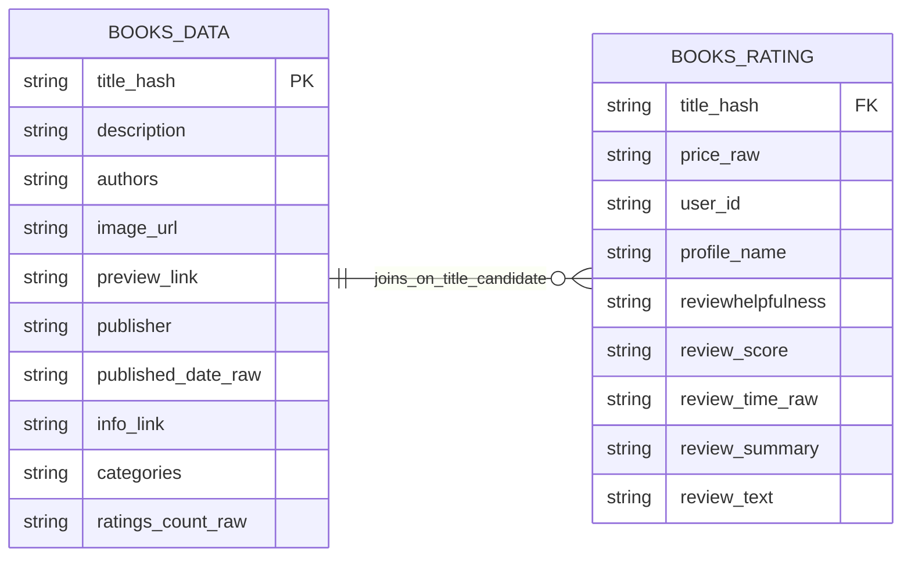
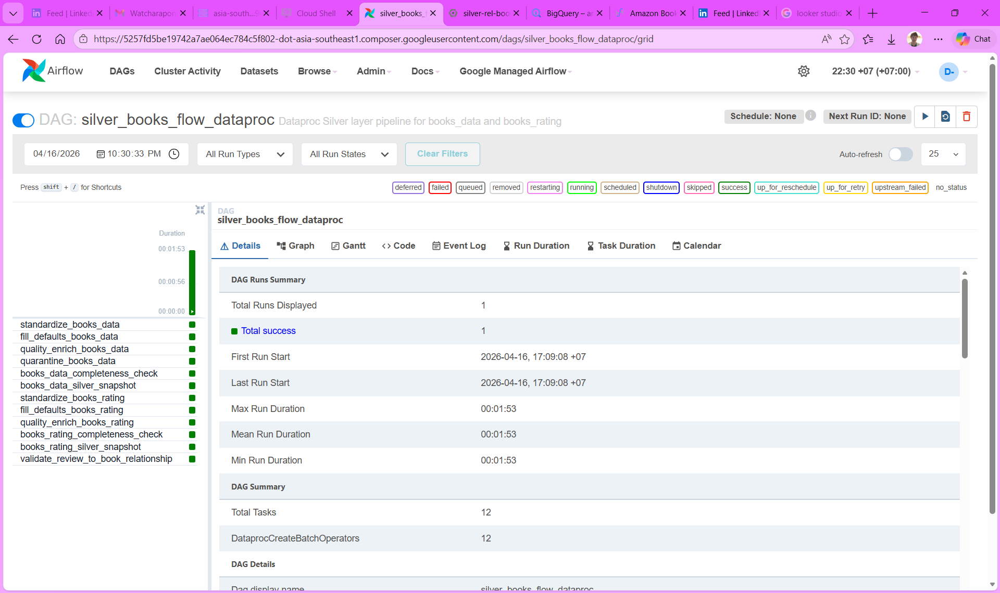
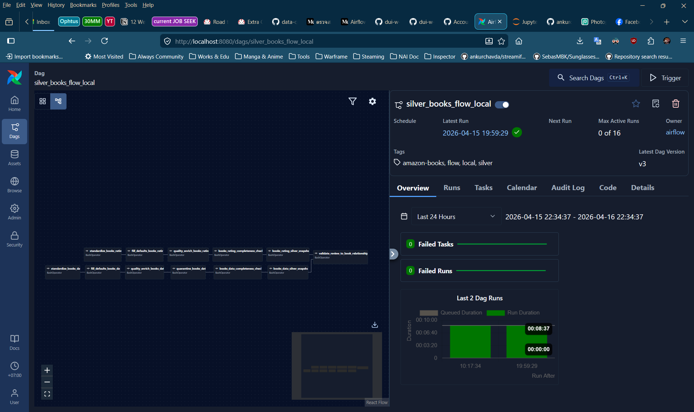

# 📚 Amazon Books Data Engineering Pipeline (End-to-End)
โดย **ดุ๋ย – วัชรพงษ์ มูลรินทร์**  
By **Dui – Watcharapong Moonrin**

> README หน้านี้เป็นเวอร์ชันภาษาไทยสำหรับใช้เป็น portfolio / GitHub project page  
> โปรเจกต์นี้โฟกัสการสาธิตความสามารถสาย **Data Engineer** เป็นหลัก ไม่ได้เน้นทำ dashboard เชิง Data Analyst แบบเต็มรูปแบบ

[เวอร์ชันเต็ม (ไทย) สามารถอ่านได้ที่นี่]('README_FULL.md')


[English version can be read here]('README_EN.md')


---
## 🚀 ภาพรวมโปรเจกต์

โปรเจกต์นี้เป็นพอร์ตสาย **Data Engineering** ที่ออกแบบ pipeline แบบ **end-to-end** สำหรับจัดการข้อมูลรีวิวหนังสือ Amazon ขนาดใหญ่ ตั้งแต่ชั้นข้อมูลดิบไปจนถึงชั้นข้อมูลพร้อมใช้งานสำหรับปลายทาง 2 กลุ่ม ได้แก่

- **Data Analyst (DA)** สำหรับงานวิเคราะห์ รายงาน และ dashboard
- **Data Scientist (DS)** สำหรับงาน Machine Learning / NLP ในอนาคต

ชุดข้อมูลต้นทางมีขนาดประมาณ **3 GB** และถูกออกแบบให้ไหลผ่าน pipeline แบบ **Bronze → Silver → Gold** โดยใช้แนวคิด **config-driven / environment-driven pipeline** เพื่อลดการ hardcode และทำให้สามารถแยกการทำงานระหว่าง local environment และ production-style environment บน GCP ได้ชัดเจน

---

## 🎯 กรณีศึกษาทางธุรกิจ


ข้อมูลดิบของ Amazon Books ไม่พร้อมสำหรับการใช้งานปลายทางโดยตรง เนื่องจากมีทั้งขนาดใหญ่ โครงสร้างข้อมูลไม่สม่ำเสมอ และมีคุณภาพข้อมูลที่ต้องผ่านการจัดการก่อน

### บทบาทของแต่ละทีม

- **Data Analyst (DA)** ต้องการข้อมูลที่สะอาดและพร้อมใช้งานสำหรับ dashboard และ report
- **Data Scientist (DS)** ต้องการข้อมูลรีวิวที่คัดกรองและจัดรูปแบบแล้ว สำหรับนำไปต่อยอดด้าน sentiment / NLP
- **Data Engineer (DE)** รับโจทย์จากทั้งสองฝั่ง แล้วออกแบบ pipeline แบบ **batch-oriented** เพื่อให้ข้อมูลถูกส่งต่ออย่างเหมาะสม

### สรุปโจทย์แบบ STAR

**S – Situation**  
มีข้อมูลรีวิวหนังสือ Amazon ขนาดประมาณ 3 GB ซึ่งใหญ่เกินกว่าจะนำไปใช้งานปลายทางตรง ๆ ได้อย่างมีประสิทธิภาพ

**T – Task**  
ออกแบบและพัฒนา pipeline เพื่อ ingest, clean, standardize, validate และ publish ข้อมูลให้พร้อมสำหรับ downstream use cases ของทั้ง DA และ DS

**A – Action**  
พัฒนา pipeline แบบ Bronze → Silver → Gold โดยใช้ PySpark สำหรับการแปลงข้อมูล, GCS สำหรับ storage, Dataproc สำหรับ processing, Airflow / Cloud Composer สำหรับ orchestration และ BigQuery เป็น serving layer

**R – Result**  
ได้ pipeline ที่สามารถส่งข้อมูลจาก raw source ไปยัง BI-ready layer ได้จริง และสามารถนำข้อมูลปลายทางไปเชื่อมกับ Looker Studio เพื่อสาธิต downstream analytics consumption ได้

---

## 🗂 Dataset

โปรเจกต์นี้ใช้ข้อมูลจาก [Amazon Books Reviews dataset](https://www.kaggle.com/datasets/mohamedbakhet/amazon-books-reviews/data) ซึ่งมีข้อมูลรวมประมาณ **3 GB** แบ่งเป็น 2 ตารางหลัก

| Table Name       | Description                      | Rows       | Size      |
|------------------|----------------------------------|------------|-----------|
| `books_data`     | ข้อมูลระดับหนังสือ              | 212,404    | ~181 MB   |
| `books_rating`   | ข้อมูลระดับรีวิว / ธุรกรรมรีวิว | 3,000,000  | ~2.86 GB  |

### 🧱 Entity Relationship - ERD (ช่วงออกแบบ Pipeline)



---

## 🏗 ภาพรวมสถาปัตยกรรม


### Architecture Layers

- **Source Layer**  
  Amazon Books raw dataset (`books_data`, `books_rating`)

- **Bronze Layer**  
  เก็บข้อมูลดิบและแปลงเป็น parquet เพื่อให้พร้อมสำหรับ downstream processing

- **Silver Layer**  
  ทำความสะอาดข้อมูล, standardize schema, เติมค่า default ที่จำเป็น, enrich คุณภาพข้อมูล, และทำ data quality checks

- **Gold Layer**  
  เตรียมข้อมูลสำหรับ consumption ปลายทาง ทั้งฝั่ง BI และ future DS use case

- **Serving Layer**  
  ใช้ BigQuery สำหรับ serving tables / views

- **Consumption Layer**  
  ใช้ Looker Studio สำหรับสาธิต downstream analytics consumption

---

## 🛠 Tech Stack

### Core Data Engineering
- **PySpark**
- **Apache Airflow**
- **Google Cloud Composer**
- **Google Cloud Storage (GCS)**
- **Google Cloud Dataproc Serverless**
- **BigQuery**
- **Looker Studio**

### Local Development / Reproducibility
- **Docker**
- **Docker Compose**
- **Apache Airflow 3.2.0 (Local)**
- **Python**
- **VS Code**
- **Git / GitHub**

### Cloud / Production-style Components
- **Apache Airflow 2.10.5 on Cloud Composer**
- **Kubernetes (K8s)**
- **Dataproc Serverless Batches**
- **GCS Buckets**
- **BigQuery serving layer**
- **IAM / Service Accounts**
- **Cloud Logging**
- **Kaggle dataset as source ingestion target**

### Data Processing / Data Modeling Approach
- **Bronze → Silver → Gold**
- **Config-driven transformations**
- **Environment-driven path resolution**
- **Data quality checks**
- **Relationship checks**
- **Serving views for BI consumption**

---

## 🖥 Airflow in Production vs Local

### Airflow 2.10.5 + Cloud Composer + Dataproc (Production-style)



ภาพนี้แสดง production-style orchestration บน **Cloud Composer / Airflow 2.10.5** ที่ใช้ควบคุม Dataproc batch jobs บน GCP โดยเน้นการทดสอบลำดับงานจริงใน cloud environment เช่น

- ingest Bronze บน GCS
- transform Silver บน Dataproc Serverless
- orchestrate ลำดับงานผ่าน Composer
- ตรวจสอบ dependency และสถานะงานจาก Airflow UI

ประสบการณ์จากภาพนี้ช่วยยืนยันว่า pipeline ไม่ได้หยุดอยู่แค่ local prototype แต่ถูกยกขึ้นไปทดสอบบน managed cloud environment แล้วจริง

> หมายเหตุ: environment ที่ใช้มีข้อจำกัดด้าน CPU quota ทำให้บาง jobs ต้องรันแบบ serial มากกว่า parallel

---

### Airflow 3.2.0 + Docker (Local Development)



ภาพนี้แสดง local development environment ที่ใช้ **Apache Airflow 3.2.0 ผ่าน Docker** เพื่อใช้พัฒนาและทดสอบ DAG, scripts, config, และ job logic ก่อนยกบางส่วนขึ้นไปยัง production-style path บน GCP

จุดประสงค์ของ local Airflow environment คือ

- พัฒนา pipeline อย่างรวดเร็ว
- debug logic ได้ง่าย
- ทดสอบ config-driven workflow ก่อนใช้งานจริงบน cloud
- แยก local iteration ออกจาก production-style environment อย่างชัดเจน

การมีทั้ง local และ production-style Airflow ทำให้โปรเจกต์นี้สะท้อน workflow แบบ local-to-cloud progression ได้ชัดเจนขึ้น

---

## 🔄 แนวคิดหลักของโปรเจกต์: Environment-Driven / Config-Driven Pipeline

หนึ่งในจุดสำคัญของโปรเจกต์นี้คือการพยายามลดการ hardcode ภายใน pipeline ให้มากที่สุด โดยใช้แนวคิด:

- **Environment-driven**
- **Config-driven**
- **Reusable jobs / transformers**
- **Minimal code changes across environments**

แทนที่จะ hardcode path, asset name, หรือ business rules ไว้ในไฟล์ job โดยตรง โปรเจกต์นี้แยกสิ่งเหล่านั้นออกไปไว้ในไฟล์ config

---

## 🧠 หลักการออกแบบเพื่อลด Hard Code

### 1) แยก config ตาม environment

โครงหลักใน repo ถูกแยกเป็น

```text
config/
  assets/
    local.data_assets.json
    dataproc.data_assets.json
  local/
    ...
  dataproc/
    ...
```

แนวคิดคือ

- **local** ใช้ path แบบ local filesystem
- **dataproc / prod-style** ใช้ path แบบ GCS (`gs://...`)

---

### 2) แยก asset path ออกจาก job logic

ตัวอย่างเช่น job จะไม่ได้รู้ path จริงของ `silver_quality_enriched` โดยตรง  
แต่จะรู้แค่ว่า:

- dataset = `books_data`
- asset = `silver_quality_enriched`

จากนั้นจึงให้ utility layer ไป resolve path จากไฟล์ asset config

ตัวอย่างเช่น:

- `config/assets/local.data_assets.json`
- `config/assets/dataproc.data_assets.json`

ทำให้ job code สามารถ reuse ได้ โดยไม่ต้องแก้ business logic ทุกครั้งที่เปลี่ยน environment

---

### 3) แยก business rules ออกมาเป็น JSON

ตัวอย่างเช่นการ fill default values จะไม่ได้ฝังไว้ใน Python code ตรง ๆ แต่เก็บไว้ใน config เช่น

- `config/local/fill_defaults/books_data_fill_defaults.json`
- `config/dataproc/fill_defaults/books_data_fill_defaults.json`

ภายในกำหนด rule เช่น

- `authors -> Unknown Author`
- `publisher -> Unknown Publisher`
- `categories -> Uncategorized`
- `user_id -> anonymous_user`
- `profile_name -> Anonymous`

ทำให้การปรับกฎในอนาคตทำได้โดยเปลี่ยน config มากกว่าเปลี่ยน logic ใน code

---

### 4) แยก orchestration ออกจาก transformation logic

โปรเจกต์นี้แยกชัดระหว่าง

- **DAG / Runner layer**
- **Job layer**
- **Transformer / Quality layer**
- **Config layer**

ตัวอย่างแนวโครงสร้าง:

```text
dags/
scripts/
src/jobs/
src/transformers/
src/quality/
src/utils/
config/
```

ข้อดีคือ

- DAG ทำหน้าที่ orchestration
- scripts ทำหน้าที่เป็น runners / entrypoints
- jobs ทำหน้าที่ควบคุมลำดับงานระดับ job
- transformers / quality รับผิดชอบ business logic เฉพาะด้าน
- config เก็บ environment-specific และ business-specific rules

---

## 🗺 Flow ของโปรเจกต์: ไฟล์ไหนเรียกไฟล์ไหน

ด้านล่างเป็นแนวคิดการไหลของ pipeline แบบย่อ

### Local Flow

```text
Airflow DAG (dags/local/*.py)
    -> scripts/local/run_*.py
        -> src/jobs/*.py
            -> src/transformers/*.py / src/quality/*.py
                -> resolve paths from config/assets/local.data_assets.json
                -> read config from config/local/**.json
                -> read/write local parquet outputs
```

### Production-style Dataproc Flow

```text
Cloud Composer DAG (dags/dataproc/*.py)
    -> Dataproc batch
        -> scripts/dataproc/run_*_dataproc.py
            -> bootstrap_dataproc.py
                -> remap runtime/config loader for GCS usage
            -> src/jobs/*.py
                -> src/transformers/*.py / src/quality/*.py
                    -> resolve paths from config/assets/dataproc.data_assets.json
                    -> read config from config/dataproc/**.json
                    -> read/write GCS parquet outputs
```

---

## 🥉 Bronze Layer

Bronze layer มีหน้าที่ ingest ข้อมูลดิบเข้าสู่ระบบ และเปลี่ยนรูปแบบจาก raw CSV ไปเป็น parquet โดยยังเก็บลักษณะของข้อมูลให้ใกล้เคียงต้นฉบับมากที่สุด

### งานหลักใน Bronze

- รับ raw CSV
- rename/select columns
- เก็บผลลัพธ์เป็น parquet
- ลดขนาดไฟล์จาก CSV เพื่อให้ processing ชั้นถัดไปทำงานได้ง่ายขึ้น

### ตัวอย่าง asset flow

#### books_data
- `raw_csv`
- `bronze_full`

#### books_rating
- `raw_csv`
- `bronze_full`

---

## 🥈 Silver Layer

Silver layer เป็นชั้นที่สำคัญที่สุดของโปรเจกต์นี้ เพราะเป็นชั้นที่ทำให้ข้อมูล “พร้อมใช้”

### งานหลักใน Silver

- standardize schema
- cast data types
- parse date / time
- generate helper keys เช่น `title_key`, `title_hash`
- fill default values สำหรับบางฟิลด์ที่ null
- enrich quality-related flags
- split eligible vs quarantine
- run data quality checks
- run relationship checks

---

## ✨ Silver Step เพิ่มเติม: Fill Default Values

จุดที่เพิ่มขึ้นจากรอบแรกของ pipeline คือ step `fill_defaults` ซึ่งถูกแทรกไว้ระหว่าง

```text
standardize -> fill_defaults -> quality_enrich
```

เหตุผลที่แยก step นี้ออกมาต่างหากแทนการฝังไว้ใน standardize คือ

- responsibility ชัดกว่า
- debug ง่ายกว่า
- ปรับ business rule ได้จาก config
- อธิบายใน portfolio ง่ายกว่า

ตัวอย่าง default values ที่ใช้จริง:

### books_data
- `authors` → `Unknown Author`
- `publisher` → `Unknown Publisher`
- `categories` → `Uncategorized`

### books_rating
- `user_id` → `anonymous_user`
- `profile_name` → `Anonymous`

---

## 🧪 6 เสาหลักด้าน Data Quality (6 Data Quality Pillars)

ในโปรเจกต์นี้ มีการออกแบบแนวคิดด้าน data quality โดยอิงกับมุมมอง 6 มิติหลัก ได้แก่

### 1) Completeness
ตรวจว่าฟิลด์สำคัญมีข้อมูลหรือไม่

ตัวอย่าง:
- `description`
- `authors`
- `publisher`
- `published_date`
- `categories`
- `ratings_count`

รวมถึงการเพิ่ม `completeness_score` เพื่อช่วยประเมินความพร้อมของ record

---

### 2) Validity
ตรวจว่าค่าข้อมูลอยู่ในรูปแบบที่ถูกต้องหรือไม่

ตัวอย่าง:
- `published_date` ไม่ควรอยู่ในอนาคต
- `ratings_count` ไม่ควรติดลบ
- `review_score` ควรอยู่ในช่วงที่ถูกต้อง

---

### 3) Consistency
ตรวจความสอดคล้องของข้อมูลภายใน record และระหว่าง layers

ตัวอย่าง:
- ชื่อ field หลัง standardize ต้องสม่ำเสมอ
- data type ต้องตรงกับที่ pipeline คาดหวัง
- การ rename / cast ต้องให้ผลลัพธ์แบบเดียวกันทุก environment

---

### 4) Uniqueness
ตรวจความซ้ำของ key หรือ record สำคัญ

ตัวอย่าง:
- monitor duplicate บน `title_key`
- ติดตามความซ้ำของ key ที่ใช้ downstream join

---

### 5) Timeliness
ตรวจความสมเหตุสมผลของข้อมูลเชิงเวลา

ตัวอย่าง:
- วันที่ไม่ควรอยู่ในอนาคต
- ข้อมูล review_date ควรพร้อมสำหรับการทำ trend analysis

---

### 6) Integrity / Relationship
ตรวจความสัมพันธ์ระหว่างตาราง

ตัวอย่าง:
- ใช้ `title_hash` เพื่อตรวจความเชื่อมโยงระหว่าง `books_data` และ `books_rating`
- ทำ cross-table relationship checks เพื่อดูว่า review ฝั่ง rating สามารถ match กับฝั่ง book ได้ในระดับที่ยอมรับได้หรือไม่

> หมายเหตุ: ในบางกรอบจะใช้คำว่า **Accuracy** แทนบางมิติ แต่ในโปรเจกต์นี้ฝั่งที่ลงมือ implement ชัดที่สุดคือ completeness, validity, consistency, uniqueness, timeliness และ relationship/integrity

---

## 🥇 Gold Layer

Gold layer เป็นชั้นสำหรับส่งมอบข้อมูลให้ปลายทาง

### แนวทางของโปรเจกต์ในสถานะปัจจุบัน

- **Bronze production path** ถูกยกขึ้น GCP แล้ว
- **Silver production path** ถูกยกขึ้น GCP แล้ว
- **Gold production path** ยังอยู่ระหว่างปรับปรุงเพิ่มเติม
- เพื่อไม่ให้ downstream delivery หยุด โปรเจกต์นี้ใช้แนวทาง **bypass local validated gold output ไปยัง BigQuery ก่อน** เป็น interim serving approach

แนวคิดนี้สะท้อนมุมมองแบบ engineer ว่า  
**ส่งมอบผลลัพธ์ปลายทางให้ใช้งานได้ก่อน ภายใต้ข้อจำกัดที่มี**  
แทนที่จะหยุดทั้งโปรเจกต์เพื่อรอ production Gold orchestration ให้เสร็จ 100%

---

## 📦 BigQuery Serving Views

เพื่อสาธิตว่า data pipeline ส่งต่อไปถึงชั้น consumption ได้จริง โปรเจกต์นี้สร้าง serving views สำหรับ BI เช่น

- `v_book_performance_bi`
- `v_review_daily_bi`
- `v_category_summary_bi`

หน้าที่ของ views เหล่านี้ไม่ใช่เพื่อทำ dashboard ที่ลึกแบบ Data Analyst เต็มตัว แต่เพื่อพิสูจน์ว่า

- BigQuery serving layer พร้อมใช้งาน
- downstream BI tools สามารถเชื่อมต่อได้จริง
- pipeline ไปถึงปลายทางได้จริง

---

## 📊 Looker Studio Demo


https://datastudio.google.com/s/rl8YWVJNbvg

***เนื่องจากเป็นเพียงการสาธิตว่าสามารถนำ Gold ไปใช้งานขึ้น BI ได้ จึง Implement DEMO เพียงบางส่วนเท่านั้น***

Looker Studio ถูกใช้ในโปรเจกต์นี้เพื่อสาธิตการใช้งานข้อมูลปลายทางแบบรวดเร็ว โดยมีเป้าหมายหลักคือ

- แสดงว่า serving views พร้อมใช้งาน
- แสดงว่าข้อมูลจาก BigQuery ถูกนำไปใช้ใน BI layer ได้จริง
- แสดง final handoff capability ของ Data Engineer

จุดประสงค์ของ dashboard นี้ **ไม่ใช่การทำ storytelling เชิงธุรกิจแบบเต็มรูปแบบ**  
แต่เป็นการทำ **BI sample output** เพื่อแสดงปลายทางของ pipeline

---

## ⏱ การแยก Local vs Production-style

โปรเจกต์นี้ตั้งใจแยก local กับ production-style ออกจากกันชัดเจน เพื่อไม่ให้ของฝั่งทดลองไปรบกวนของฝั่ง cloud path

แนวคิดนี้ช่วยในเรื่อง

- รักษา local pipeline ให้เสถียร
- ทดสอบ production path แยกออกไป
- debug ปัญหาได้เฉพาะ environment
- ขยายพอร์ตให้เล่าเรื่อง local-to-cloud progression ได้ชัดเจน

---

## ⚠️ ปัญหาและข้อจำกัดที่เจอจริงระหว่างพัฒนา

ส่วนนี้เป็นหนึ่งในหัวใจของโปรเจกต์ เพราะสะท้อน “ประสบการณ์จริง” มากกว่าการทำแค่ notebook

### 1) RAM ระเบิดระหว่าง exploratory work บน local
ข้อมูลรีวิวมีขนาดใหญ่มากจนบางวิธีการ profiling / loading แบบไม่ระวัง memory ทำให้เครื่อง local รับภาระหนักเกินไป  
บทเรียนคือ ต้องเลือกเครื่องมือและวิธีการอ่านข้อมูลให้เหมาะกับขนาดจริงของ dataset

---

### 2) Dataproc Serverless มี CPU quota จำกัด
ใน environment ที่ใช้ พบข้อจำกัดด้าน `CPUS_ALL_REGIONS` โดย Dataproc job หนึ่งชุดต้องใช้ resource ขั้นต่ำค่อนข้างสูง  
ผลคือ

- ไม่สามารถรันหลาย jobs แบบ parallel ได้ตามใจ
- บางช่วงแม้แต่ single batch ก็ fail เพราะ available CPU ต่ำกว่าที่ต้องใช้
- ต้องออกแบบ DAG ให้รันแบบ serial / queue-based มากขึ้น

ข้อจำกัดนี้เป็นเหตุผลสำคัญที่ทำให้ production path ต้องค่อย ๆ เดินทีละชั้น และไม่ควรฝืนออกแบบ parallelism เกิน resource ceiling

---

### 3) Dependency packaging บน Dataproc
การส่ง code ไปให้ Dataproc Serverless ใช้งานจริงไม่ใช่แค่อัป main script แล้วจบ  
ต้องจัดการเรื่อง

- package visibility
- code bundle
- import path
- `__init__.py`
- runtime bootstrap

นี่เป็นปัญหาที่ local environment มักไม่เจอ แต่ production runtime เจอทันที

---

### 4) Spark ancient date / datetime rebase issue
เมื่อเขียน parquet บน Spark 3+ แล้วเจอค่าประเภท date ที่เก่าเกิน threshold ที่ Spark เตือน  
job จะ fail จนกว่าจะตั้งค่า `datetimeRebaseModeInWrite` ให้เหมาะสม

ปัญหานี้ทำให้ต้องเข้าใจว่า **data issue + engine behavior** สามารถชนกันได้ในระดับ runtime จริง

---

### 5) Path / filesystem mismatch ระหว่าง local กับ serverless runtime
config บางชุดที่ยกมาจาก local ใช้ path สำหรับ artifacts แบบ local relative path  
เมื่อไปรันบน Dataproc Serverless กลับกลายเป็น permission issue หรือเขียนไม่ได้ใน system path

บทเรียนคือ  
แม้ config จะดู reuse ได้ แต่ต้องตรวจให้แน่ใจว่า output path, temp path และ summary path เหมาะกับ runtime environment จริง

---

### 6) Airflow / Composer path resolution
ฝั่ง Composer มีประเด็นเกี่ยวกับ

- DAG import path
- config file location
- path relative to DAG folder
- environment-specific config loading

สิ่งเหล่านี้ทำให้เห็นว่าการย้ายโค้ดจาก local ไป managed orchestration ไม่ได้แปลว่าจะใช้ path เดิมได้ทันที

---

### 7) Trade-off เพื่อให้ delivery เดินต่อได้
เมื่อ production Gold ยังไม่ปิดครบ แต่ Silver และ serving layer ไปได้แล้ว จึงตัดสินใจใช้

> **validated local Gold output → load to BigQuery → connect to Looker Studio**

เป็นแนวทางชั่วคราว เพื่อให้ downstream delivery เดินต่อได้  
นี่เป็นการตัดสินใจเชิงวิศวกรรมที่เน้นผลลัพธ์และการส่งมอบ มากกว่าการรอให้ทุกส่วนสมบูรณ์ก่อน

---

## 💡 ทักษะที่แสดงในโปรเจกต์นี้

- ออกแบบ data pipeline แบบ Bronze → Silver → Gold
- ใช้ PySpark สำหรับ processing ข้อมูลขนาดใหญ่
- แยก local / production-style pipeline
- ออกแบบ config-driven / environment-driven workflow
- ใช้ GCS, Dataproc, BigQuery, Airflow / Composer และ Looker Studio
- ทำ data quality checks หลายมิติ
- จัดการ dependency / packaging / orchestration issues บน cloud runtime
- ตัดสินใจ trade-off เพื่อส่งมอบ output ภายใต้ข้อจำกัดจริง

---

## 📁 Repository Structure

```text
project-root/
│
├── config/
│   ├── assets/
│   ├── local/
│   └── dataproc/
├── dags/
│   ├── local/
│   ├── dataproc/
│   └── shared/
├── data/
│   ├── raw/
│   ├── bronze/
│   ├── silver/
│   ├── gold/
│   └── quarantine/
├── docs/
│   └── images/
├── scripts/
│   ├── local/
│   └── dataproc/
├── src/
│   ├── jobs/
│   ├── transformers/
│   ├── quality/
│   └── utils/
├── Dockerfile
├── docker-compose.yml
├── requirements.txt
└── README.md
```

---

## 🔒 Scope (MVP)

โปรเจกต์นี้ตั้งใจทำในระดับ **MVP สำหรับสมัครงานสาย Data Engineer** โดยโฟกัสที่สิ่งสำคัญก่อน ได้แก่

- batch ingestion
- data transformation ด้วย PySpark
- local + production-style cloud path
- BigQuery serving layer
- BI demonstration
- README / GitHub packaging

### สิ่งที่ยังไม่รวมใน MVP

- streaming / real-time pipeline
- full production monitoring / alerting
- production-grade CI/CD
- Infrastructure as Code แบบเต็มระบบ
- advanced observability framework

---

## 🚧 Future Improvements

- เพิ่ม unit / integration tests
- ขยาย quality checks ให้ครบทุกมิติยิ่งขึ้น
- ปรับ tuning / partitioning ให้เหมาะกับ data volume มากขึ้น
- เพิ่ม lineage / observability
- ทำ English README version ให้สมบูรณ์
- ขยาย DS-ready serving outputs ให้ลึกขึ้น
- เติม SCD Type-2 ในตาราง โดยใช้ทุก field xxhash64 เป็น hash_value

---

## ✅ สรุป

โปรเจกต์นี้เป็น Data Engineering portfolio ที่ออกแบบมาเพื่อสาธิตความสามารถในการส่งข้อมูลจาก raw source ไปยัง serving layer ที่พร้อมใช้งานจริง โดยครอบคลุมทั้ง

- local development path
- production-style processing on GCP
- BigQuery serving layer
- downstream BI demonstration
- ข้อมูลสามารถถูก ingest, transform, validate และ publish ได้จริง
- pipeline สามารถไหลจาก raw layer ไปจนถึง BI-ready layer ได้จริง
- ผู้พัฒนามีประสบการณ์แก้ปัญหาเชิง runtime, packaging, resource quota, config separation และ cloud limitations ในบริบทใกล้เคียงงานจริง

โปรเจกต์นี้จึงถูกวางตำแหน่งให้เป็น **Data Engineer portfolio** อย่างชัดเจน มากกว่าการเป็น dashboard portfolio เพียงอย่างเดียว
